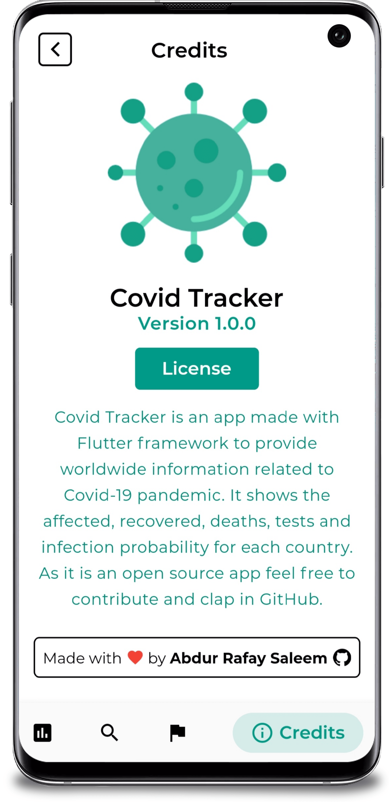
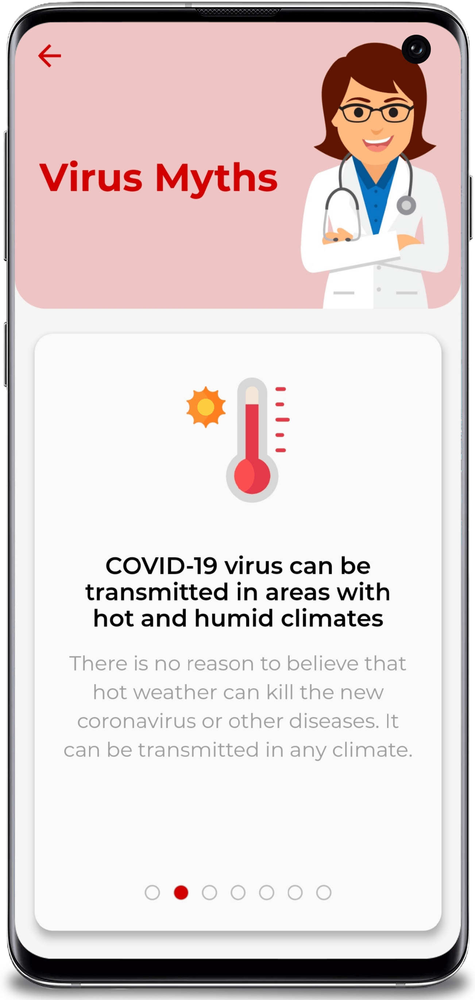

# wuhanvirus

WuhanVirus is an app made with Flutter framework to provide worldwide information related to Covid-19 pandemic.Download the Apk [wuhanVirus](https://drive.google.com/file/d/1BgQSgeQdBrlsrCpBpvpWISxeu40fydRW/view?usp=sharing)

## Features

- Global case count.
- Case, death and recovery count of each country
- Total tests and infection probability of each country
- News updates related to vaccine developement
- Info, symptoms, precautions and myths of the virus
- Setting a default country

This is a fork of [Repo](https://github.com/arafaysaleem/covid_tracker) with extra functionalities go there and star it.

<kbd></kbd>

  

&nbsp;&nbsp;&nbsp;  
&nbsp;  
&nbsp;&nbsp;&nbsp;

## ⭐ Future Features

- ~~Drawer for easier navigation~~ (Added)
- Backend API with Django
- Onboarding screens
- Login authentication using API
- Maps API to detect nearby danger spots

_Feel free to fork and contribute to include these features._ ❤︎

## 🚀 Technologies

- [Flutter v1.17.4](https://storage.googleapis.com/flutter_infra/releases/stable/windows/flutter_windows_1.17.4-stable.zip)
- [Dart v2.8.4](https://dart.dev/get-dart)

## 🤝 Contribute

To contribute, fork the repository and push the changes to the **master** branch. Then submit a pull request for merging with the source. If your code passes the review and checks it will be merged into the master branch.

## 💬 Feedback

Feel free to send us feedback on [Twitter](https://twitter.com/gitpointapp) or [file an issue](https://github.com/arafaysaleem/covid_tracker/issues/new). Feature requests are always welcome.

## 📝 License

Licensed under the [MIT License](./LICENSE).
